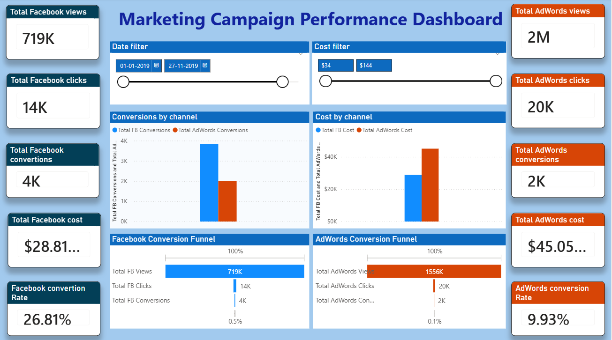
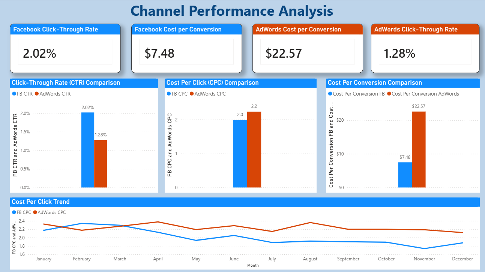
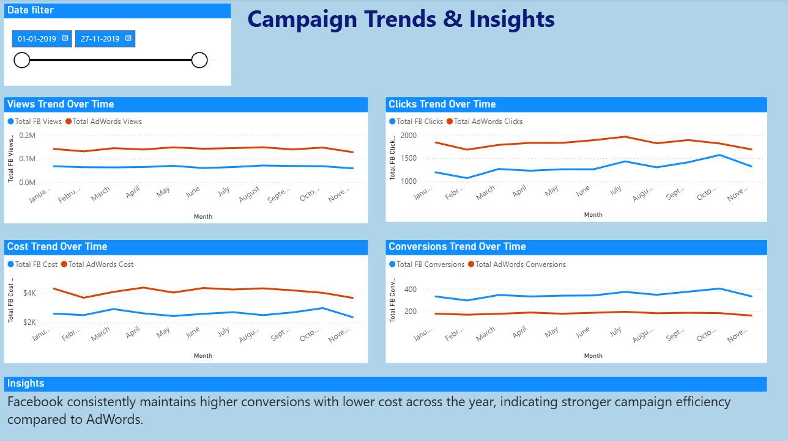

# 📊 A/B Testing & Regression Analysis: Facebook Ads vs Google AdWords Campaign Performance

## 🚀 Project Overview

Digital marketing teams frequently invest across multiple advertising platforms, but determining **which platform delivers better conversions and return on investment (ROI)** remains a critical challenge.

This project performs a **comparative A/B Testing analysis between Facebook Ads and Google AdWords campaigns** to evaluate performance differences, identify key conversion drivers, and provide **data-driven marketing optimization strategies**.

The analysis replicates a real-world business scenario where companies must decide how to allocate marketing budgets efficiently across platforms.

---

## 🎯 Business Objective

The primary objectives of this project are:

* Compare the effectiveness of **Facebook Ads vs Google AdWords**
* Measure statistical significance between campaign performances
* Identify customer attributes influencing conversions
* Provide actionable recommendations to optimize marketing spend
* Demonstrate end-to-end analytics workflow for business decision-making

---

## 🧠 Key Business Questions

* Which platform generates higher conversion rates: Facebook Ads or AdWords?
* Are the performance differences statistically significant?
* What factors influence campaign success?
* How can marketing teams optimize budget allocation?
* Can predictive modeling improve targeting efficiency?


---

# 📊 Power BI Dashboard 

To complement the statistical analysis, an interactive **Power BI dashboard** was developed to visualize and compare the performance of Facebook and Google AdWords marketing campaigns.

The dashboard enables dynamic exploration of campaign metrics, cost efficiency, and conversion performance using interactive slicers and cross-filtering capabilities.

---


## 📈 Dashboard Features

✔ Multi-page interactive report  
✔ KPI comparison across Facebook and AdWords  
✔ Conversion funnel analysis  
✔ Cost and performance efficiency metrics  
✔ Time-series trend visualization  
✔ Dynamic filters for date and cost analysis  
✔ Cross-filtering across visuals  

The PBIX file included in this repository contains a fully interactive dashboard.

---

## 📑 Dashboard Pages

### Executive Overview

Provides a high-level comparison of campaign performance with KPIs, funnels, and cost insights.



---

### Channel Performance Analysis

Focuses on engagement metrics, cost efficiency, and marketing effectiveness indicators.



---

### Trends & Insights

Shows time-based performance patterns across views, clicks, conversions, and cost.




---


## 📂 Dataset Description

The dataset includes structured marketing campaign performance metrics such as:

* Advertising platform (Facebook / AdWords)
* Customer demographics
* Engagement metrics
* Click behavior
* Conversion outcomes
* Behavioral indicators

These features enable statistical testing and predictive modeling to evaluate campaign performance.

---

## ⚙️ Methodology

The project follows a complete **data analytics lifecycle**:

### 1️⃣ Data Cleaning & Preparation

* Handling missing values
* Data transformation
* Feature formatting for analysis

### 2️⃣ Exploratory Data Analysis (EDA)

* Platform-wise performance comparison
* Conversion distribution analysis
* Customer behavior patterns
* Engagement trends

### 3️⃣ A/B Testing & Hypothesis Testing

* Statistical significance testing between Facebook and AdWords campaigns
* Confidence interval interpretation
* Business impact validation

### 4️⃣ Correlation & Feature Analysis

* Identifying key drivers influencing conversions
* Relationship between campaign variables

### 5️⃣ Predictive Modeling

* Machine learning model to predict conversion probability
* Performance evaluation metrics

### 6️⃣ Business Insights & Recommendations

* ROI-focused platform optimization strategies
---


## 🔍 Key Insights

✅ One advertising platform demonstrates significantly higher conversion efficiency
✅ Statistical testing confirms measurable performance differences between Facebook Ads and AdWords
✅ Customer segmentation plays a major role in campaign success
✅ Engagement metrics strongly influence conversion probability
✅ Data-driven targeting strategies can substantially improve ROI

---

## 💡 Business Recommendations

* Allocate higher budget toward the better-performing platform
* Continuously perform A/B testing to optimize ad creatives and targeting
* Implement predictive analytics to identify high-conversion users
* Use audience segmentation to personalize campaigns
* Monitor campaign KPIs through dashboards for real-time decision-making

---

## 🛠️ Technologies Used

* Python
* Pandas & NumPy
* Matplotlib & Seaborn
* Scikit-learn
* Statistical Hypothesis Testing
* Jupyter Notebook

---

## 📁 Project Structure

```
AB-Testing-Facebook-vs-AdWords/
│── data/
│── notebooks/
│── images/
│── README.md
```

---

## 🎯 Business Impact

This project demonstrates how organizations can:

* Optimize marketing budget allocation
* Improve customer targeting strategies
* Increase campaign conversion rates
* Reduce customer acquisition cost
* Make data-driven marketing decisions

---

## 👨‍💻 Author

**Ashish S**
Aspiring Data Analyst | Data Science Enthusiast

* LinkedIn: (https://www.linkedin.com/in/ashish-sriramoju)

---

## ⭐ Why This Project Matters

This project showcases **real-world marketing analytics and experimentation skills**, including:

✔ A/B Testing & Experiment Design
✔ Statistical Analysis & Hypothesis Testing
✔ Marketing Performance Evaluation
✔ Predictive Modeling
✔ Business Storytelling with Data

These are critical competencies for **Data Analyst / Marketing Analyst / Data Scientist roles**.

---

## 📬 Feedback & Collaboration

If you have suggestions, feedback, or collaboration opportunities, feel free to connect!

---

⭐ If you found this project useful, consider giving it a star!
